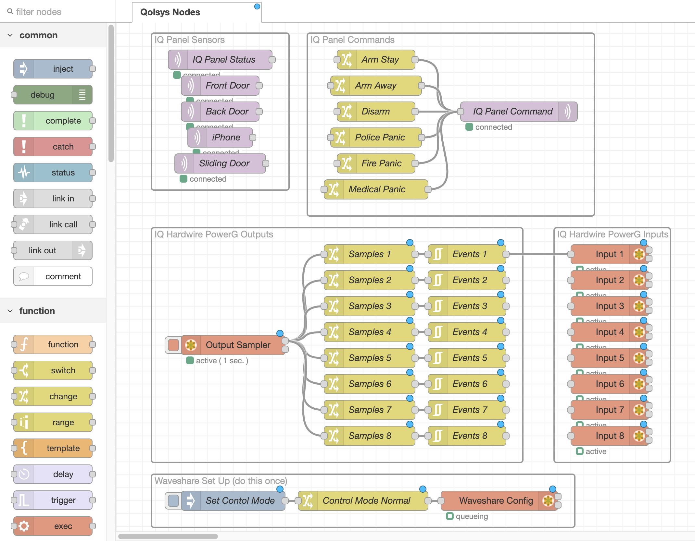
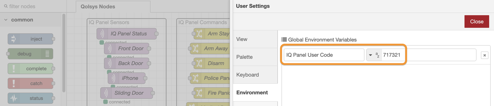

# IQ Mate (Qolsys IQ Panel Integration & Automation Tool)

IQ Mate is a tool to help more serious home automation folks make the most of their Qolsys IQ Panel. Use it to integrate your IQ Panel with devices outside of the Qolsys & Alarm.com walled garden.

IQ Mate interacts with the IQ Panel in 2 ways:

1. It uses the [Qolsys Gateway](https://github.com/XaF/qolsysgw) integration from Home Assistant to interact with the [IQ Panel Control4](https://qolsys.reamaze.com/kb/connections-and-configurations/how-to-integrate-your-iq-system-with-control-4) integration, which gives IQ Mate real-time sensor status and lets it arm and disarm the IQ Panel.
2. `To Do` It uses Qolsys Programmable (PGM) Outputs and Sensor Inputs to send and receive on/off signals with the IQ Panel. This enables virtually any automation to be programmed with any device, even if it's not compatible with Qolsys or Alarm.com. It's not super efficient but it works.

Automations are programmed in [Node-RED](https://nodered.org/), a visual flow editor that makes it easy to program complex automations.

## Installation

The easiest way to install is to use the [IQ Mate Docker Image](https://hub.docker.com/r/suretyhome/iqmate) by following the instructions on that page.

If you want to develop or modify IQ Mate, clone those repository build the docker image yourself. There are scripts in the do/ directory to help build and run the image.

## Using IQ Mate

IQ Mate automatically discovers the sensors on your IQ Panel and provides a tab (aka flow) called `Qolsys Nodes` that serves as a pallet you can copy from. Create a new tab in Node-RED and copy/paste nodes from the `Qolsys Nodes` tab as needed.

This [demo video](https://vimeo.com/1025543285?share=copy#t=0) shows a simple example monitoring the status of the panel and a door sensor in the debug panel, arming and disarming the IQ Panel.

See the [Node-RED Documentation](https://nodered.org/docs/) to learn more about what you can do with Node-RED.

### IQ Panel Set Up

Some of the panel commands, such as Disarm, require a user code. The first thing to do after installation is to set a panel user code. In Node RED, go to Settings > Environment and enter user code for `IQ Panel User Code`.

### IQ Hardwire PowerG Set Up

