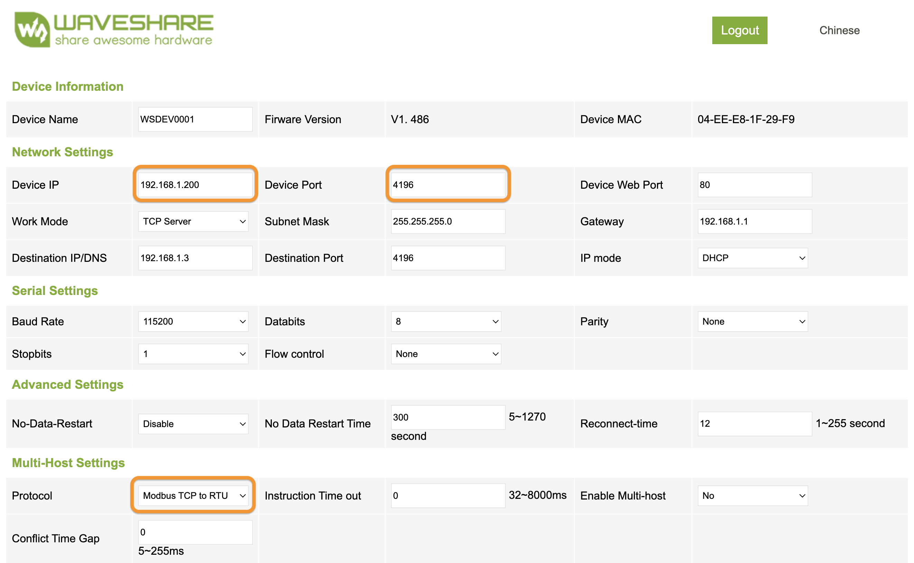
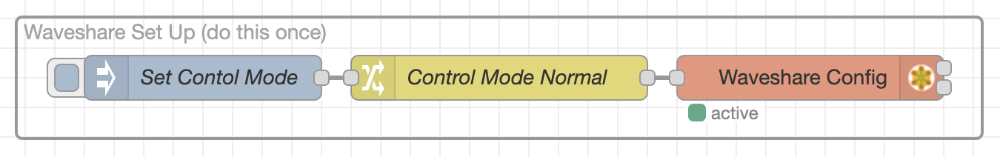

# IQ Mate (Qolsys IQ Panel Integration & Automation Tool)

IQ Mate is a tool to help more serious home automation folks make the most of their Qolsys IQ Panel. Use it to integrate your IQ Panel with devices outside of the Qolsys & Alarm.com walled garden.

IQ Mate interacts with the IQ Panel in 2 ways:

1. It uses the [Qolsys Gateway](https://github.com/XaF/qolsysgw) integration from Home Assistant to interact with the [IQ Panel Control4](https://qolsys.reamaze.com/kb/connections-and-configurations/how-to-integrate-your-iq-system-with-control-4) integration, which gives IQ Mate real-time sensor status and lets it arm and disarm the IQ Panel.
2. It uses Qolsys Programmable (PGM) Outputs and Sensor Inputs to send and receive on/off signals with the IQ Panel. This enables virtually any automation to be programmed with any device, even if it's not compatible with Qolsys or Alarm.com. It's not super efficient but it works.

Automations are programmed in [Node-RED](https://nodered.org/), a visual flow editor that makes it easy to program complex automations.

## Installation

The easiest way to install is to use the [IQ Mate Docker Image](https://hub.docker.com/r/suretyhome/iqmate) by following the instructions on that page.

If you want to develop or modify IQ Mate, clone those repository build the docker image yourself. There are scripts in the do/ directory to help build and run the image.

## Using IQ Mate

IQ Mate automatically discovers the sensors on your IQ Panel and provides a tab (aka flow) called `Qolsys Nodes` that serves as a pallet you can copy from. Create a new tab in Node-RED and copy/paste nodes from the `Qolsys Nodes` tab as needed.

This [demo video](https://vimeo.com/1025543285?share=copy#t=0) shows a simple example monitoring the status of the panel and a door sensor in the debug panel, arming and disarming the IQ Panel.

See the [Node-RED Documentation](https://nodered.org/docs/) to learn more about what you can do with Node-RED.

### IQ Panel Set Up

Follow [these instructions](https://qolsys.reamaze.com/kb/connections-and-configurations/how-to-integrate-your-iq-system-with-control-4) to enable the Control4 integration on your IQ Panel and get your secure token. After your IQ Panel reboots, you have 10 minutes to run IQ Mate and connect to the IQ Panel. If you don't connect within 10 minutes then the IQ Panel will automatically disable the Control4 integration and you'll have to start over.

Some of the panel commands, such as Disarm, require a user code. The first thing to do after installation is to set a panel user code. In Node RED, go to Settings > Environment and enter user code for `IQ Panel User Code`.

### IQ Hardwire PowerG Set Up

To use the digital IO featured of IQ Mate, you'll some hardware. The recommended hardware is:

* [IQ Hardwire PowerG](https://suretyhome.com/product/iq-hardwire-powerg/)
* [Waveshare Ethernet Digital IO Module](https://www.waveshare.com/modbus-poe-eth-relay-b.htm.htm)
  * Optionally get the [12V Power Supply](https://www.waveshare.com/ord-psu-12v2a-5.5-2.1.htm) but this device can be powered by the IQ Hardwire PowerG auxiliary power. 
* [Ethernet Crossover Cable](https://www.monoprice.com/search/index?keyword=crossover+cable) or [build your own](https://www.electronicproducts.com/how-to-create-your-own-ethernet-cross-over-cable/)
  * A direct link from your host computer to the digital IO module is recommended because it uses insecure Modbus to communicate. If you put in on your network then you need a way to secure it with a VLAN or by limiting access your network.

> Alternatively, the [RS-422 version](https://www.waveshare.com/product/modbus-rtu-relay-d.htm) of the Waveshare digital IO module can be used instead of Ethernet. You would need an RS-422 adapter for your host computer. These instructions assume you're using the Ethernet version.

The digital IO module is similar to the IQ Hardwire PowerG, it has digital (sensor) inputs and programable outputs. By connecting the outputs on the IQ Hardwire PowerG to the inputs on the digital IO module, and the outputs in the digital IO module to the sensor inputs on the IQ Hardwire PowerG, you can detect PGM Outputs from the Qolsys system, build whatever automation logic you want in Node RED, and send signals back into the Qolsys system.

This basic digital IO integration lets you:

* Build more advanaced automation logic that isn't possible in Qolsys & Alarm.com
* Integrate devices and systems that aren't compatible with Qolsys and Alarm.com

The Waveshare Ethernet digital IO module defaults to having the static IP address 192.168.1.200. Configure the Ethernet adapter on your host computer to have an address on the 192.168.1.xxx subnet. Then go to [192.168.1.200](http://192.168.1.200/) and login with the default password `Password`.

Under Multi-Host Settings, change the Protocol from `None` to `Modbus TCP to RTU`. You can edit the IP settings if you need to but the defaults should work fine in most cases. Then click `Submit` to save the settings.

Now you can connect to digital IO module in Node RED. If you need to change any connection settings in Node RED, go to Configuration Nodes and edit the node called Waveshare IO Module.

The module has a few different [working modes](https://www.waveshare.com/wiki/Modbus_POE_ETH_Relay_(B)#Working_Mode_Introduction). We want it to be in `Normal Mode` but it might default to another mode. In Node RED, use the Waveshare Set Up nodes to set the working mode to normal mode.

That's it, now you're ready to automate through the IQ Hardwire PowerG.